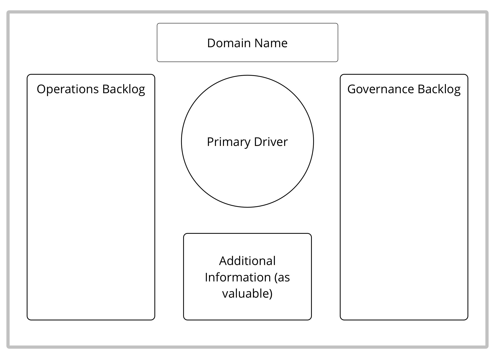

# 19.09.2019

## Темы обсуждения

* Бирюзовый эксчейндж \(Обмен опытом через сотрудников\)
* Взаимодействие с небирюзовыми \(Услуги экспертов, как понят что они мне нужны если я не особо в курсе
* Комментарий про Эго
* Проблемы в бирюзе
* Чем яв-ся Тил для участников сообщество?
* Бирюзовые игры

## Чекин

Хочу бирюзовую Украину. Макс

Самый продвинутый инстурмент.

Как в широких системах делать бирюзу.

1. Мировозрение людей. 2\) Личная и коллективная культура.

Александр из Беларусь. Применяю практики бирюзы давно.

Пошел на + благодаря бирюзе.

1. Взаимодействие руков. компании
2. Геймификация

Бирюза это тип мышление. Прокачать все нижние уровни.

Как управлять организ. при помощи манифестов. Либеральные рынки. Написал книгу по нему начали создавать компании.

Внутренний посыл. Чем отличается от обычных подходов.

Коментарий ЭГО:

Коментарий которые оставялли под вопросом: Самая большая проблема внедрения бирюзы.

Когда начали делать Тил было 100 воодушевленных. Сегодня немного потух.

## Про Эго

Когда я пытался что-то менять в орг. всегда было столкновение с ЭГО.

Есть уровни развития эволюция Эго. Кто-что думает ? В контексте бирюзы Эго?

Это расширение и выходы в неопределенеость, котора. Функция контролирующая, твою безопасность.

Эго - это Я. Есть мы . Это нормально. Эволюция эго, когда принимаешь других как факт. Строишь коммуникацию через точки соприкосновения. Уровень сознания и осознания себя. Положительная.

Чувство когда становишься больше, ты мы только не теряя себя.

Эго в контексте проблем 1\) как мы относимся к друг-другу. которая зарождает процес обмена. Быть пипл позитив. 2\) Как мы видим людей, набор интерпретации. поведенческий характер.

Эго - амбиций, желание власти, контралируют. Не воспринимают критику.

Больное эго. Бирюза это суть а не форма, они друг на друга влияют. Когда ты ставишь форму, в холократич. процессе и все ее обсуждают, влияет. Мы чаерез процесс меняем и мышление. Развитие я и есть развитие мы.

Есть опыт без эго? Если есть то ты амеба.

Когда бирюза расстворяется, много любви, зачем вмешиваться? Ты ленивый.

Эго-амбиций. Задаю вопрос- Какую стадию я прохожу? Эго-осознанность. Осозхгнание себя в этом мире, понимание своих границ, чужих границ. Прохождение в состояние просветленности.

Эго это псих. функция. Разум- отвечает за выживание. Мышление - Сливаться с Мы . Помогает сливаться в другими. Слишком много амбиций, дисфункция между мной и другими.

ошибочное мнение: Про бирюзу, это не про деньги. Не происходит монетиз. все сливаются.

Ошибки внедрения. Слишком увлекаются в игру отношений.

Как привязать внизу. Волна.

Когда люди внедряли инструмент, может быть опасно, они могут за скрываться процедурами.

Может мы хотим воспитывать в организациях бирюзовых людей ?

Организационная гештальт терапия. Кто учит: Виталий Елисеев. \(Одесса\)

Интересен переход. Например: кто-то готов сказать "не расчитывайте на меня", кто-то заточен на синюю-оранжевую.

Это хуже чем если скрепя зубами будешь делать. Конфликта может не возникать если от тебя не ожидают к какой-то дате. Какие-то задачи люди делают без сроков и спокойной выполняют свои задачи.

Так что делать с такими сотрудниками которые не хотят работать?

## Как мы находим своих бирюзовых?

Если нет пространства для нет – то не будет настоящего да. Система его отрегулирует. Может сам уйти. Но бывает иногда нужно и выгнать.

У одной компании молодая команда. Рассказывали что сами по себе самоорганизованы. Рассказывали про свой факап и минусы дружелюбности. Несколько раз не обратили внимание на факапы.

Важно пройти и зеленый – единство, отношения. И им тяжело сказать нет. Возникает зависимость.

Как дать понять человеку что его подходы не работают?

В любой организации можно использовать единые правила фидбека.

Вот мы делали разные ивенты, просим фидбек. Пробуем разные способы.

Как делать – может отличаться, но суть все равно вокруг ценностей человека. Если кон становиться большим – уже нужно будет что-то решать.

Как строить такие смыслы, гармонировать внутреннее и внешнее внимание.

Можно увольнять до бесконечности, но если не разобраться с причиной – будет бесполезно. Даже коучинг может не помочь.

**Проблема:** Если организовывать организацию с бирюзовым подходом – как воспитывать или брать.

Делать бизнес со своим кругом, собрать людей а потом понять что делать.

А если надо быстро рости?

А зачем тебе быстро рости?

Переход с уровня на уровень от 3х \(с коучингом\) до 8 лет.

Можно провести еще тестирование по ценностям. Также склонность к гибкости и открытому мышлению. У нас к этому только присматриваются. Человек может быть негибким.

Как повысить скорость обучения.

Может у человека нет запроса – тогда не работаем. Но может быть запрос надо раскрыть.

Как выялять. Ценности трансформируются в модели поведения. Человек может себя продавать то что ты хочешь услышать.

Есть же уровень зрелости личности...

Можно опираться на свои чувства. Чем больше ты общаешься и применяешь инструментов – тем лучше видно.

Проводил игры на эту тему, в игре человек проявляется естественно. Мозг выдает реакции на раздраджители.

Где эти маркеры?

Можно взращивать.

Когда пришла на собеседование – часть прочитала, часть сказала что нехватает. Я ищу команду, место где я могу работать. Спросила а зачем вы работаете в этой компании? Они засмущались.

Человек с бирюзовыми ценностями не будет притворяться. Не будет напрашиваться. В такии компании нужно брать зрелых людей и зрелость ощущается.

Сам когда проходил собеседования. Хотел сам сказать что не подхожу.

Клиент предлагал поработать в НЛП а не коучинге. Коучинг более быстрый и эффективный чем психотерапия. Захожу в туалет – для девочек все штуки есть. Спросила зачем нужен НЛП? Мы для каждого ТОПа нанимем коуча который будет прорабатывать с ним личные цели. Мало видела таких подходов. Не про команду, бизнес, а личные вопросы.

Как компании приходят к коучингу? дорастают. Могут быть компании которые работают уже 100 лет. У Голландцев например уже сообщество на зеленом уровне. А некоторые хотят попробовать – но нет быстрых результатов.

Коучинг просто формат. У компании есть запрос. Само выстраивание отношений включает часть консультирования какой формат больше подходит. Есть некий запрос и от этого идет.

## Как появляется запрос на внешнего специалиста?

Это идет не по запросу, а получается как у людей...

В моем опыте все так и было.

Был и другой опыт – когда компании ищут. Приходят в ICF и говорят – решили поработать с коучингом.

Просто одна девочка рассказала про свой опыт и это была лучшая реклама.

Долго был сторонникам инструкций а теперь совсем по-другому. Сам смысл в чем? Если это инструкция по безопасности жизни – тогда да. В остальном компании пытается себя обезопасить от сотрудников. и К этому относятся соответственно. Появляется свобода – инструкции игнорируют. Все так быстро меняется что нужно постоянно обновлять и следить.

## Чем помочь?

Что делаете со знаниями? Как применяете? Когда делала тил нетворк – хотела узнать какие темы интересуют людей и делать обучение по ним.

Запросы:

* интересно заходить в компанию и исследовать ее \(интересно Оле\)
* найти людей кто этим живет
* если будем собираться хоть каждый день, за пределами круга ничего не изменится
* люди могут транслировать идеи
* есть еще формат интервизии – можно попробовать такой формат
* приходить и решать вопросы
* поиграть \(важно понять сколько людей будет\)

##  Closing round

* Посоветуюсь, спасибо что пришли. Важно чтобы это сообщество жило и рада что вы пришли
* Было интересно, формат понравился. Формат дискуссии и обсуждения кейсов нравится и подходит
* Понравилось, не было особых ожиданий, рада что что-то такое есть, хотелось бы попасть на след встречу
* Прикольно, рада всех видеть, интересно об кого-то подумать
* Рад что познакомился, приятная атмосфера. Есть общие тема для обсуждения. Есть разные взгляды, но общий вектор. Соображение подтягивается. Давайте обменяемся контактами
* Было очень приятна энергия. Понимаю что бирюза это такое разное.
* На прошлый тил прислал своего hr, сказал что ничего не понял. Есть ощущение что для людей которые не в контексте – мы ты провели время ни о чем. Я чувствую смысловую сытость  
* Прошлая встреча была не такая. Решил дать второй шанс. Друг друга не слышали.
* Давайте больше таких встреч

