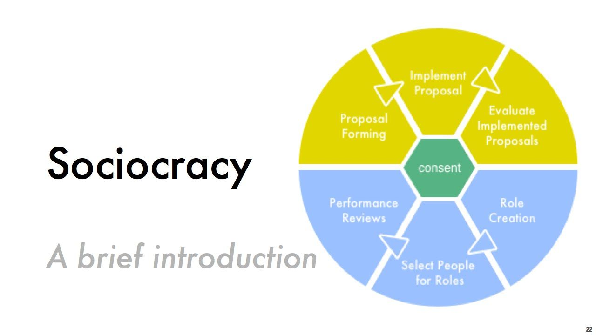

# Социократия

Во всем это призвана помочь Социократия \(Sociocracy Overview\), означающая «правление общества, коллегиальное управление». Метод становится все более популярным способом управления и принятия решений на основе принципов прозрачности, равновесности и эффективности.

Это более эффективная альтернатива Консенсусу, добавляющая легкость и позитив в процесс принятия и реализации решений

Метод Социократии разработал в 1970 году Герард Энденбург, голландский инженер, изобретатель, специалист по кибернетике, чтобы помочь своей компании “Энденбург Электротекник” функционировать более гармонично. В США иногда Социократию называют «Динамическим Управлением».

По опыту Даяны Кристиан, когда кохаузинги, экопоселения, и другие виды сообществ и поселений использует социократию, их процессы управления, как правило, становятся гораздо более эффективными и приятным.

Социократия использует петли обратной связи — критерии, встроенные в каждое решение для последующего измерения и оценки того, насколько эффективно решение функционирует в «реальной жизни» после того, как оно реализовано. Социократия позволяет эффективно и позитивно обходить “подводные камни” других методов принятия решений, таких как единогласие или консенсус, в которых один-два человека могут заблокировать очень важное для сообщества решение. Также социократия функционирует продуктивнее, чем принятие решений простым голосованием большинства — так как включает в себя эффективную структуру, позволяющую довести идею от обсуждения и голосования до, собственно, реализации.

## См также

* [https://patterns.sociocracy30.org/pattern-index.html](https://patterns.sociocracy30.org/pattern-index.html)
* [https://patterns.sociocracy30.org/](https://patterns.sociocracy30.org/)
* [https://sociocracy30.org/](https://sociocracy30.org/)

